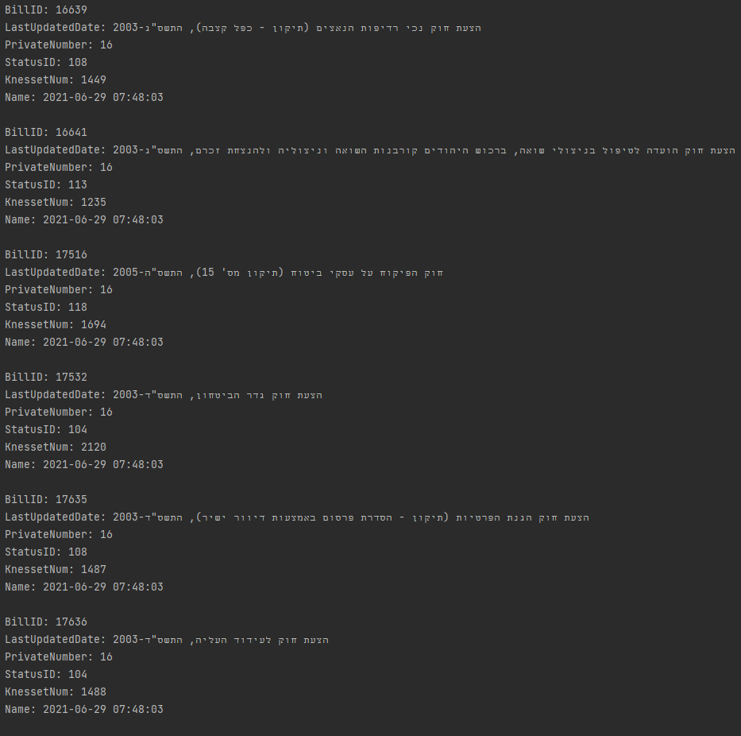
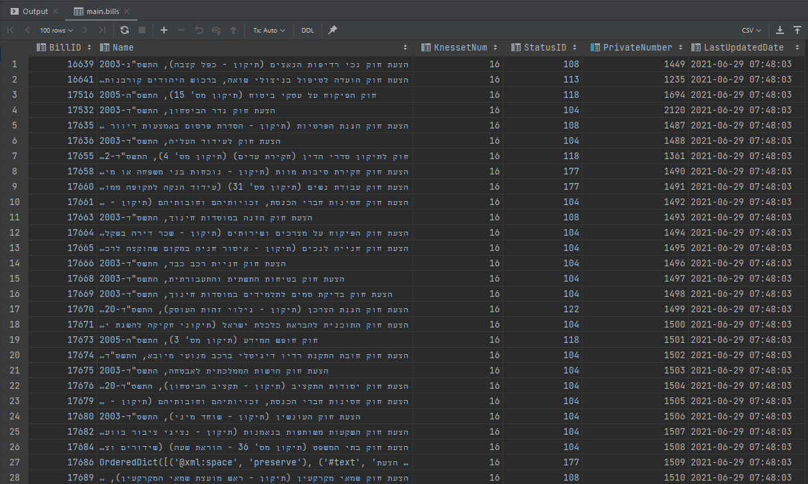

# <i>Programming Research Algorithms Assignment 8</i>

> Databases

### <i>Question 1:</i>

In this task I've built a program that take data from web API using requests, and then insert the data in SQLite table.


*Explanations:*

The main program is the [main.py](q1/main.py) file, this program will first use the ```get_kns_bill_data``` function from [get_data_from_api.py](q1/get_data_from_api.py) file, this function will get all the data in xml format from this [url]("http://knesset.gov.il/Odata/ParliamentInfo.svc/KNS_Bill()?$filter=SubTypeID%20eq%2054&$expand=KNS_BillInitiators").

After the main program get all the xml bills data it will use the ```build_bill_objects``` function from [data_utils.py](q1/data_utils.py) file, this function will convert all the xml data to a list of python object called ```Bill``` from the [bill.py](q1/bill.py) file.

Then creates a ```DBUtils``` class instance that will connect to our SQLite databases. 

* If the program run for the first time and the ```bills``` table in the Database has not created yet, we can use the ```create``` function in the ```DBUtils``` class that create the table. 

In ```DBUtils``` class we have a bunch of functions that help us control our ```bills``` table in the SQLite Database, the table data format is:

| Attribute Name | Data Type | Explanation | 
|---|---|---|
| ```BillID``` | ```int key``` | ID code of the bill | 
| ```Name``` | ```string``` | Name describe the bill |
| ```KnessetNum``` | ```int``` | The Knesset number when the bill suggested |
| ```StatusID``` | ```int``` | Status number code of the bill |
| ```PrivateNumber``` | ```int unique``` | The private number of the bill |
| ```LastUpdatedDate``` | ```datetime``` | The datetime of the the last update of this bill |

Then the main program will iterate each ```Bill``` objects in the list and insert it to the database using the ```insert``` function in DBUtils class in [db_utils.py](q1/db_utils.py) file, then we can use the ```print_table``` function in the ```DBUtils``` that print all the data in the ```bills``` table using ```SELECT * FROM bills``` query.

* For example, the data that printed after we inserted the ```bills``` data is (first 6 rows):



* Other example is to look at the SQLite console by typing in the ```SELECT * FROM bills```:

